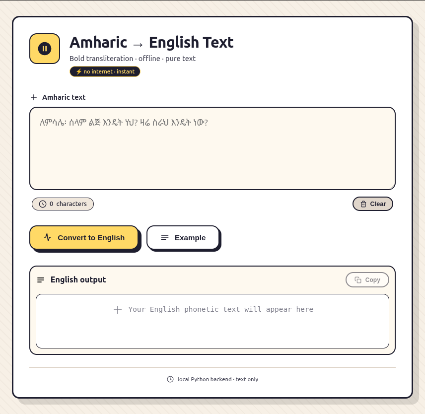

# Amharic → English Text Converter

A modern, offline desktop application that transliterates Amharic (አማርኛ) script into English phonetic text. Built with **Eel** (Python + HTML/CSS/JS) and featuring a **neo‑brutalist** interface with a consistent **15px border radius**.

 <!-- optional: add a screenshot -->

## ✨ Features

- **Instant transliteration** – Converts Amharic text to readable English phonetics.
- **Fully offline** – No internet connection required after installation.
- **Neo‑brutalist UI** – Bold borders, vibrant accents, and satisfying hover effects.
- **Copy to clipboard** – One‑click copy of the converted text.
- **Character counter** – Displays the length of your input.
- **Example text** – Quickly load a sample Amharic phrase.
- **Clear input** – Reset the textarea with a single click.
- **Cross‑platform** – Works on Windows, macOS, and Linux (via Python + Eel).

## 🛠️ Tech Stack

| Component        | Technology                         |
|------------------|------------------------------------|
| Backend          | Python 3.x                         |
| Frontend         | HTML5, CSS3, JavaScript (vanilla)  |
| Bridge           | [Eel](https://github.com/ChrisKnott/Eel) |
| Styling          | Neo‑brutalist design, inline SVGs  |

## 📁 Project Structure

```
amharic-english-converter/
├── web/                     # Frontend files
│   ├── index.html           # Main UI (neo‑brutalist)
│   ├── css/
│   │   └── style.css        # Styling with 15px border radius
│   └── js/
│       └── script.js        # Frontend logic (Eel calls)
├── main.py                  # Python backend with Eel
├── requirements.txt         # Python dependencies
└── README.md                # This file
```

## 🚀 Getting Started

### Prerequisites

- Python 3.7 or higher installed on your system.
- A modern web browser (Chrome, Edge, Firefox) – Eel uses Chromium if available, otherwise falls back to the default browser.

### Installation

1. **Clone or download** this repository.
2. Open a terminal in the project folder.
3. Install the required Python package:

```bash
pip install eel
```

### Running the App

1. Ensure your `main.py` (or your entry point) is properly set up with the Eel decorator. A minimal example:

```python
import eel

eel.init('web')          # Folder containing HTML/CSS/JS

@eel.expose
def amharic_to_english_sound(amharic_text):
    # Implement your transliteration logic here.
    # For demonstration, we return a placeholder.
    return "Your converted text: " + amharic_text

eel.start('index.html', size=(900, 700))
```

2. Run the Python script:

```bash
python main.py
```

The application window will open. You can now type or paste Amharic text, click **Convert to English**, and see the result.

> **Note**: The transliteration logic is placeholder in the example above. Replace it with your own rules or a mapping dictionary to produce accurate English phonetics.

## 🎨 Customization

- **Colors & borders**: Edit `web/css/style.css` – look for variables like `#1e1e2f` (dark border) and `#ffd966` (accent yellow).
- **Border radius**: All major containers use `border-radius: 15px`. Adjust to your preference.
- **Icons**: The interface uses inline SVGs. You can swap them out or replace with your own.

## 📜 License

This project is open‑source and available under the MIT License. See the [LICENSE](LICENSE) file for details.

## 🙌 Acknowledgements

- [Eel](https://github.com/ChrisKnott/Eel) – for making Python + frontend desktop apps trivial.
- Neo‑brutalist design inspiration – bold, functional, and playful.

---

Made with ❤️ for Amharic speakers and language learners.
